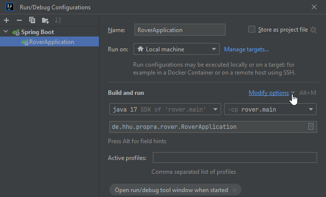
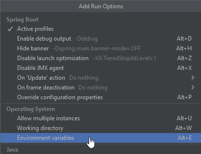
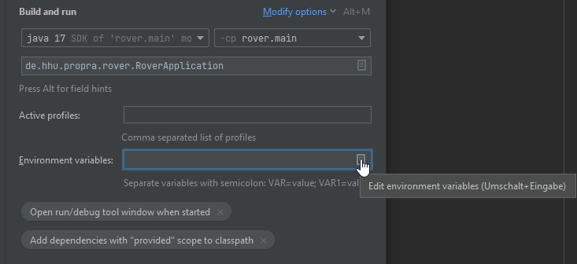
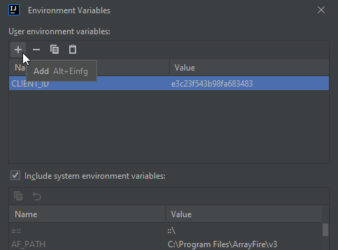

= ProPra 2 Übung 5: Spring Security
13.11.2023
:experimental:
:icons: font
:icon-set: octicon
:source-highlighter: rouge
ifdef::env-github[]
:tip-caption: :bulb:
:note-caption: :information_source:
:important-caption: :heavy_exclamation_mark:
:caution-caption: :fire:
:warning-caption: :warning:
endif::[]

== Vorwort
Diese Woche wollen wir uns mit Spring Security auseinandersetzen. Wir benutzen unsere Rover-Anwendung "Burgertown" von Übung 5 als Grundlage.

.Ziele der Übung:
* WebSecurity mit CSRF Protection einrichten
* Single-Sign-On mit GitHub einrichten
* Userinformationen auslesen
* Routen autorisieren
* Security testen

== Basic WebSecurity einrichten
Zunächst möchten wir eine Konfigurationsklasse erstellen, mit der wir später festgelegen, wie unsere Anwendung abgesichert werden soll.

.Aufgaben:

. Erstellen Sie ein package `de.hhu.propra.rover.configuration` mit einer  `WebSecurityConfiguration` Klasse, welche von `WebSecurityConfigurerAdapter` erbt, und annotieren Sie diese als Configuration.
+
.Lösungshilfe
[%collapsible]
=======
[source,java]
----
@Configuration
public class WebSecurityConfiguration extends WebSecurityConfigurerAdapter{ }
----
=======

. Kopieren Sie die folgende Methode in die Klasse und lesen Sie sich durch, was die Methode macht.
+
[source,java]
----
    @Override
    protected void configure(HttpSecurity http) throws Exception {
        http.authorizeRequests(a -> a
                        .antMatchers("/", "/error", "/css/**", "/img/**").permitAll()
                        .anyRequest().permitAll()
                )
                .exceptionHandling(e -> e.authenticationEntryPoint(new HttpStatusEntryPoint(HttpStatus.UNAUTHORIZED)))
                .logout(l -> l.logoutSuccessUrl("/").permitAll());
    }

----

== CSRF Protection
CSRF steht für Cross-Site-Request-Forgery.
Nehmen Sie an, Sie haben soeben einen neuen Highscore in unserem Spiel aufgestellt.
Dann machen Sie eine kurze Pause und besuchen `evil.com`, wo Sie ein Formular absenden.
Aber anstatt zu der Webseite selbst, geht ihr Post Request vom Browser aus zu `propra-rover.com/deleteMyHighscore` 😱.
Da der Request ganz legitim vom Browser des Users kommt, kann unsere Rover-App nicht wissen, dass der User gar nicht den Highscore löschen möchte.

//Um uns gegen solche seitenübergreifende Trickserei zu schützen, können wir ein generiertes Token in unsere Formulare einschleusen, welches wir bei POST-Requests zurückerwarten.
//Dieses Token kann `evil.com` nicht wissen und daher keine CSRF Attacken mehr durchführen.

.Aufgaben:

. Fügen Sie in der `configure` Methode folgende CSRF Protection hinzu.
+
[source,java]
----
    .csrf(c -> c.csrfTokenRepository(CookieCsrfTokenRepository.withHttpOnlyFalse()))

----

. Starte Sie das Spiel ohne Login und versuchen Sie eine Bewegung auszuführen. Was sehen Sie?

. Probieren Sie die folgenden beiden Varianten aus, um in den Formularen ein CSRF Token hinzuzufügen.

.. Fügen Sie das CSRF Token als verstecktes Inputfeld in den Formularen hinzu.
+
[source,html]
----
<input th:name="${_csrf.parameterName}" th:value="${_csrf.token}" type="hidden"/>
----

.. Lassen Sie Thymeleaf ein CSRF Token erzeugen, indem Sie `th:action` anstatt `action` in den Formularen verwenden.

. Starten Sie erneut das Spiel und kontrollieren Sie, dass nun die Bewegungen funktionieren.

== GitHub Single-Sign-On
Nun wollen wir über den OAuth2 Standard GitHub als Single-Sign-On Dienst verwenden, um uns zu authentifizieren.

Dafür muss man die Anwendung in GitHub als OAuth Anwendung registrieren. Das ist bereits heute geschehen. Man erhält eine eindeutige `Client ID`. Jede Instanz muss außerdem ein **geheimes** `Client Secret` haben, um sich als diese Anwendung bei GitHub zu identifizieren.

.Aufgaben
. Verwenden Sie heute folgende `Client ID` und `Client Secret` und fügen Sie diesen als Umgebungsvariablen in IntelliJ hinzu.
+
|===
|CLIENT_ID | CLIENT_SECRET
|ee34c10933919a8273da
|d3abfcaacee8d25c24c418652578d2bf73210174
|===

+
.Step-by-step Anleitung zum Setzen der Umgebungsvariablen
[%collapsible]
=======
In IntelliJ können Sie die Umgebungsvariablen am einfachsten über die Run Configuration setzen:

image::images/edit.png[]

=======

. Ergänzen Sie nun die `application.yml` folgendermaßen:
+
[source,yaml]
----
spring:
  security:
    oauth2:
      client:
        registration:
          github:
            client-id: ${CLIENT_ID}
            client-secret: ${CLIENT_SECRET}
----
+
[IMPORTANT]
Achten Sie darauf, dass Sie diesen Code *ohne* Einrückung einfügen.

. Passen Sie nun die `WebSecurityConfiguration` folgendermaßen an:
.. Ersetzen Sie
+
[source,java]
----
.anyRequest().permitAll()
----
durch
+
[source,java]
----
.anyRequest().authenticated()
----

.. Ersetzen Sie
+
[source,java]
----
.logout(l -> l.logoutSuccessUrl("/").permitAll());
----
+
durch
+
[source,java]
----
.logout(l -> l.logoutSuccessUrl("/").permitAll())
.oauth2Login();
----

. Was bewirken diese Änderungen?
Diskutieren Sie.

. Versuchen Sie nun sich über den Link auf der Startseite einzuloggen.

[TIP]
====
In Docker können Sie für die Client ID und das Client Secret eine `.env` Datei verwenden, welche auf jeden Fall in der `.gitignore` Datei berücksichtigt werden muss! Im Docker-Compose File können Sie dann die Informationen aus der `.env` Datei als Umgebungsvariable in den Container übertragen.

`compose.yml`:
[source, yaml]
----
version: "3.1"
services:
  application:
    # Konfiguration der Anwendung
    environment:
      - "CLIENT_ID=${CLIENT_ID}"
      - "CLIENT_SECRET=${CLIENT_SECRET}"
----
====

== Userinfos verwenden
Nun möchten wir uns anschauen, wie wir Informationen des eingeloggten Users nun verwenden können. Dafür lassen wir uns von Spring das User-Objekt, das sogenannte `Principal`, ausgeben.

.Aufgaben

. Injecten Sie in die `main` und die `won` Methode des Controllers den `@AuthenticationPrincipal OAuth2User`.

. Fügen Sie in den beiden Methoden ein Modelattribut "user" ein, welches mit dem Usernamen gefüllt ist, falls es einen eingeloggten User (User-Objekt) gibt.
Den Usernamen erhalten Sie, wenn Sie von `.getAttribute("login")` auf dem User-Objekt aufrufen.
+
.Lösungshilfe
[%collapsible]
=======
[source,java]
----
model.addAttribute("user",
        userObject != null ? userObject.getAttribute("login") : null
);
----
=======

. Wie Sie auf der Startseite sehen sollten, gibt es jetzt ein paar neue Buttons. Fügen Sie die folgenden Methoden in den `WebController` ein und schauen Sie sich an, was Ihnen dort angezeigt wird.
+
[source,java]
----

@GetMapping("/tokeninfo")
@ResponseBody
public Map<String, Object> tokeninfo(@RegisteredOAuth2AuthorizedClient OAuth2AuthorizedClient authorizedClient) {
    OAuth2AccessToken gitHubAccessToken = authorizedClient.getAccessToken();
    return Map.of("token", gitHubAccessToken);
}

@RequestMapping("/user")
@ResponseBody
public Map<String, Object> user(@AuthenticationPrincipal OAuth2User principal) {
    return principal.getAttributes();
}
----

== Autorisierung

=== Rollen zuordnen
Wir wollen nun unsere User in zwei Gruppen teilen: Administrator:innen und normale Benutzer:innen.

.Aufgaben:
. Fügen Sie in der `application.yml` die folgende Rollenkonfigurierung hinzu.
+
[source,yaml]
----
rover:
  rollen:
    admin: bendisposto, lahutar, jaste111
----

. Lassen Sie sich diese in der `WebSecurityConfiguration` Klasse per `@Value`-Annotation injecten.
+
[source,java]
----
@Value("${rover.rollen.admin}")
private Set<String> admins;
----

. Kopieren Sie die folgende Methode, mit welcher der Standard-`OAuth2UserService` überschrieben wird, in die Klasse.
+
[source,java]
----
@Bean
OAuth2UserService<OAuth2UserRequest, OAuth2User> createUserService() {
    DefaultOAuth2UserService defaultService = new DefaultOAuth2UserService();
    return userRequest -> {
        OAuth2User oauth2User = defaultService.loadUser(userRequest);

        var attributes = oauth2User.getAttributes(); //keep existing attributes

        var authorities = new HashSet<GrantedAuthority>();
        authorities.add(new SimpleGrantedAuthority("ROLE_USER"));

        String login = attributes.get("login").toString();
        System.out.printf("USER LOGIN: %s%n", login);

        if (admins.contains(login)) {
            System.out.printf("GRANTING ADMIN PRIVILEGES TO USER %s%n", login);
            authorities.add(new SimpleGrantedAuthority("ROLE_ADMIN"));
        } else {
            System.out.printf("DENYING ADMIN PRIVILEGES TO USER %s%n", login);
        }

        return new DefaultOAuth2User(authorities, attributes, "login");
    };
}
----

=== Routen zugänglich machen

Mithilfe von Spring Security können wir Routen nur für bestimmte Rollen zugänglich machen.

.Aufgaben:
. Fügen Sie die folgende weitere Konfigurationsklasse hinzu.
+
[source,java]
----
@Configuration
@EnableGlobalMethodSecurity(
        prePostEnabled = true,
        securedEnabled = true,
        jsr250Enabled = true)
public class MethodSecurityConfiguration extends GlobalMethodSecurityConfiguration {}
----

. Fügen Sie die folgende Methode in den Controller ein.
+
[source,java]
----
@GetMapping("/admin")
public String admin(Model model, @AuthenticationPrincipal OAuth2User principal) {
    model.addAttribute("user",
            principal != null ? principal.getAttribute("login") : null
    );
    return "admin";
}
----

. Fügen Sie eine Annotation hinzu, damit die `/admin` Route nur noch für Personen mit der Rolle `ROLE_ADMIN` zugänglich ist.
+
.Lösungshilfe
[%collapsible]
=======
[source,java]
----
@Secured("ROLE_ADMIN")
----
=======

. Probieren Sie diese Route nun aus. Können Sie als normaler User darauf zugreifen? Was passiert, wenn Sie Ihren GitHub-Namen als Admin eintragen und dann auf diese Route zugreifen?

.Bonusaufgabe (wenn Zeit übrig ist)
. Fügen Sie eine neue Rolle hinzu und schreiben Sie eine Handlermethode, für eine Route, die nur für diese Rolle freigegeben ist.

== BONUS: Testing
Um unsere Anwendung nun weiterhin testen zu können, benötigen wir ein paar Helferklassen, die Sie bereits unter `helper` finden. Damit können wir uns eingeloggte User simulieren.

.Aufgaben:
. Importieren Sie die Konfigurationsklassen in die `WebController` Klasse mithilfe der `@Import` Annotation.
+
.Lösungshilfe
[%collapsible]
=======
[source,java]
----
@Import(MethodSecurityConfiguration.class)
----
=======

. Testen Sie, dass Sie ohne Anmeldung keinen Zugriff auf `/game` haben.
+
.Lösungsvorschlag
[%collapsible]
========
[source, java]
----
@Test
void UnauthorizedWithoutLogin() throws Exception {
    mockMvc.perform(get("/game")).andExpect(status().isUnauthorized());
}
----
========

. Testen Sie nun mithilfe unserer vorgegebenen `WithMockOAuth2User` Annotation einen Zugriff auf `/game` durch einen eingeloggten User.
+
.Lösungshilfe
[%collapsible]
========
[source, java]
----
@WithMockOAuth2User(login = "Max Mustermann", roles = {"USER"})
----
========

. Wir können bei dem `@WithMockOAuth2User` auch Rollen festlegen. Schreiben Sie weitere Tests, mit denen die verschiedenen Zugriffe auf `/admin` getestet werden.

